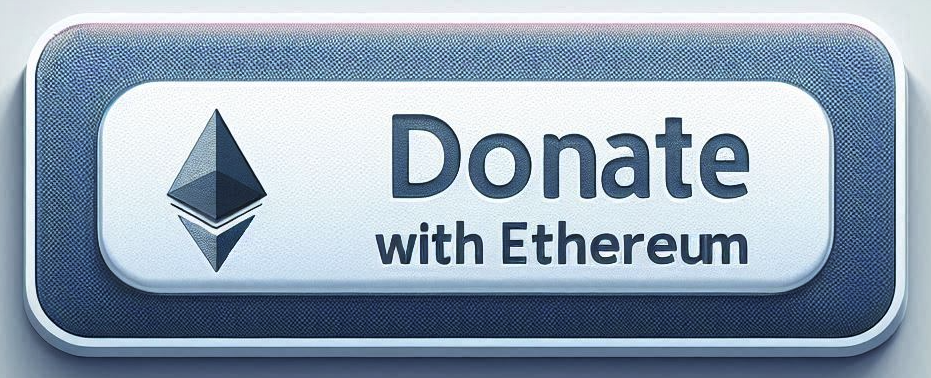

# MD Prettify: Turn Your Crappy Code into a Daily Delight! 🎉

Sick of staring at the steaming pile of garbage that is your "favorite" project's code? 
Can’t get your team to agree on whether to use !! or Boolean()? 
Tired of endless arguments over code style? 
Say hello to MD Prettify—the extension that slaps a shiny new coat of paint on your source code without ever touching the actual mess underneath! 🎨✨

[Download MD Prettify](https://marketplace.visualstudio.com/items?itemName=drboria.md-prettify)

### How Does This Magic Trick Work? 🪄

MD Prettify is your escape hatch from the chaos of ugly code and petty debates. 
It’s a **Visual Studio Code extension** that lets you prettify your source code—visually transforming it into something cleaner and more stylish—without changing a single character of the actual file. 
Think of it as a makeover for your codebase: all the glamour, none of the refactoring drama.

### Commands

The following commands are available for keybinding:
* `mdPrettify.enablePrettySymbols`: Flip the magic ON globally.
* `mdPrettify.disablePrettySymbols`: Kill the vibe (why tho?).
* `mdPrettify.togglePrettySymbols`: Switch it up whenever you feel like it!

## Configuration Examples

Explore pre-configured substitution settings for various languages in the [examples/](./examples) directory:

*   **[TypeScript looks like Python](./examples/typescript-to-python.json):** Example substitutions for TypeScript to make it look like Python language.
*   **[TypeScript looks like TrumpScript](./examples/typescript-as-python.json):** Example substitutions for TypeScript to make it look like TrumpScript language.

Feel free to contribute your own configurations for other languages!

## Custom Config

Complete guide, how to [Build Your Custom Config](./examples/custom-config.md)

## Support Me:

If you find this extension useful, please consider donating to support its development:

